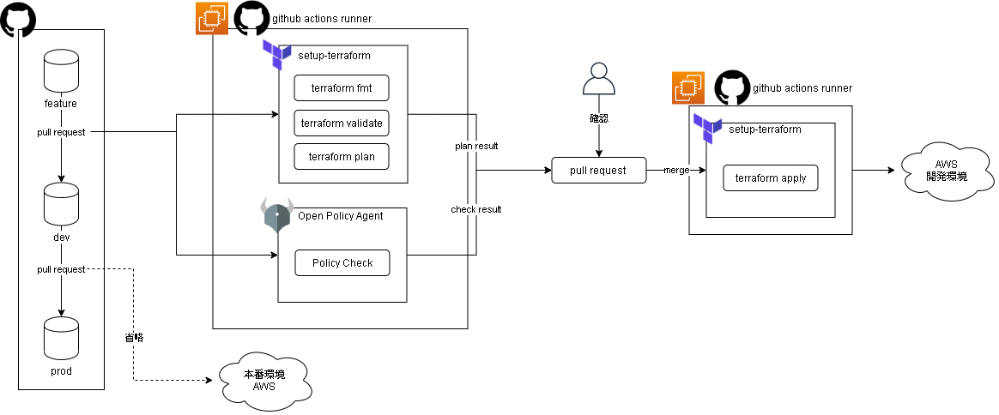

# リポジトリの概要

本リポジトリはGithubActionsを使用したTerraformコードのCICDパイプラインの仕組みと構築方法を解説したものです。  

パイプライン環境として、tfstateのリモートバックエンドとGithubActionsのセルフホストランナーをTerraformで構築します。  

また、パイプラインの動作を確認するためのサンプルTerraformコードやポリシーチェックで使用するOPAのリファレンスも用意しています。

本リポジトリで作成する環境のイメージは次の通りです。

**パイプライン環境図**


**CICDフロー図**



# バージョン

本リポジトリのモジュール群は以下のバージョンを前提としています。（構築時のバージョンも記載します。）

terraform 0.13.2 以上　（構築時 0.14.7）  
aws providor 3.5.0以上　

# 構成ツール

本リポジトリでは主に以下のようなツールを使用してCICDパイプラインを構成しています。

- [OPA](https://www.openpolicyagent.org/)
- [setup-terraform](https://github.com/hashicorp/setup-terraform)
- [github actions runner](https://github.com/actions/runner)

# ドキュメント

モジュールや使い方などのドキュメントは以下になります。

- [モジュール説明](./documents/module.md)
- [CICDフロー説明](./documents/cicd.md)
- [使い方](./documents/howtouse.md)
- [OPA/Regoリファレンス](./documents/rego.md)

# ディレクトリ説明

利用者が意識する主要なディレクトリ・ファイルについて説明します。

```
.
├── documents                 # 本リポジトリのドキュメント一式を格納しています。
│   ├── cicd.md               # CICDの流れを説明したドキュメントです。
│   ├── howtouse.md           # 本リポジトリのモジュールを使用して環境を構築する方法を解説したドキュメントです。
│   ├── module.md             # 用意しているTerraformモジュールを説明したドキュメントです。
│   └── rego.md               # ポリシーチェックで使用するOPA/Regoのリファレンスです。
├── sample-repos              # パイプライン動作確認用のサンプルTerraformコード一式を格納しています。
│   ├── .github/workflows     # GithubActionsのワークフローファイルを格納しています。
│   ├── main-template         # パイプラインを通じて構築されるテンプレートです。
│   ├── modules               # モジュールを実装したコードを格納しています。
│   └── policy                # OPAでポリシーチェックを行うためのポリシーを格納しています。
└── terraform/environment     # パイプライン環境構築用のTerraformコード一式を格納しています。
    ├── main-template         # PJごとに1度構築するテンプレートです。
    └── modules               # モジュールを実装したコードを格納しています。
```