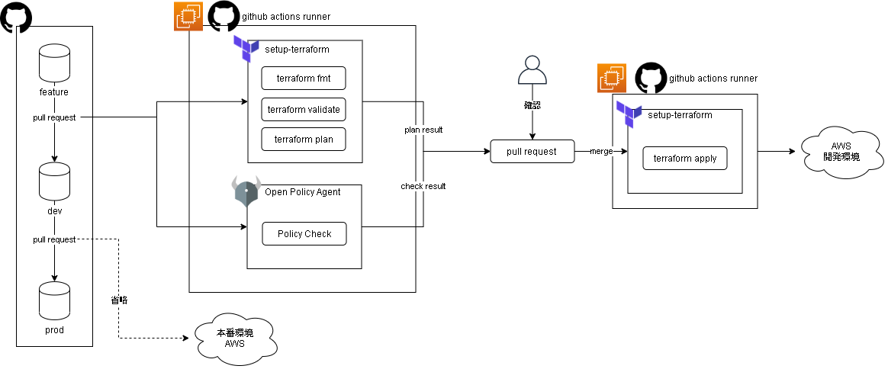
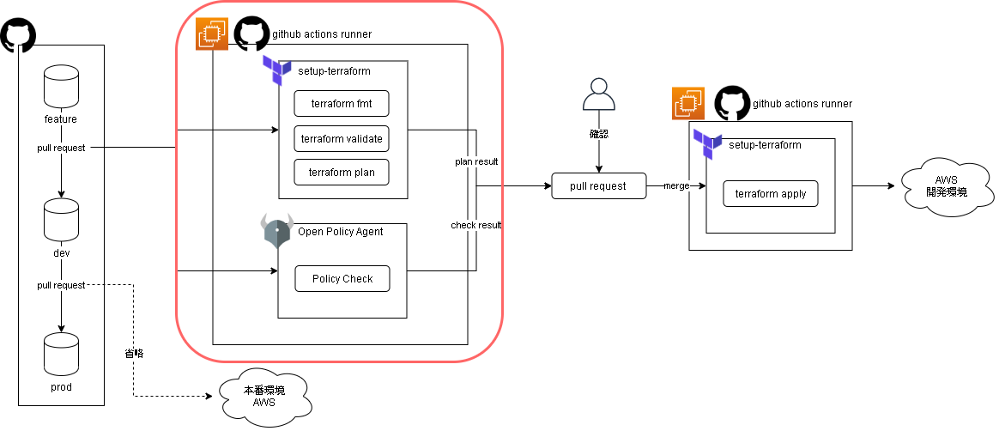

- [CICDフロー説明](#cicdフロー説明)
  - [プルリクエスト作成/更新](#プルリクエスト作成更新)
    - [terraformコマンド実行](#terraformコマンド実行)
    - [ポリシーチェック実行](#ポリシーチェック実行)
  - [プルリクエストマージ](#プルリクエストマージ)
    - [terraformコマンド実行](#terraformコマンド実行-1)

# CICDフロー説明

本レポジトリで構成するCICDについて解説します。全体の流れは以下の通りです。  

Githubにデプロイ対象のTerraformコードを用意します。プルリクエスト作成/更新によってフォーマットチェックやポリシーチェックを行ういわゆる`CI`の部分が動作し、プルリクエストマージによって実際にTerraformを実行してデプロイするいわゆる`CD`の部分が動作します。どちらもGithubActionsを使用しています。なお今回のCICDフローでは[Gitlab flow]()に則り、`feature`、`dev`、`production`の3つのブランチが登場します。  

GithubActionsへの指示は`.github/workflows/terraform-*.yml`で行います。ファイル内容を確認しながら本資料を読み進めると理解しやすいかもしれません。

## プルリクエスト作成/更新

Githubにレポジトリが存在する状態とします。プルリクエストを作成すると、GithubActionsが動作し、以下のジョブが実行されます。CI部分の実行結果はプルリクエストのコメントに出力されるため、コメントをレビューして相違なければマージに進むことになります。  
- terraformコマンド実行
- ポリシーチェック実行

なお開発環境をデプロイする`dev`ブランチの内容の修正を行う場合、`dev`ブランチから`feature`ブランチを作成して修正を行います。修正後、`feature`→`dev`方向のプルリクエストを作成します。同じように本番環境をデプロイする`production`ブランチの内容の修正を行う場合、`dev`ブランチで修正を行います。修正後、`dev`→`production`方向のプルリクエストを作成します。  
プルリクエストにコミットを追加した場合も作成時と同じようにGithubActionsが動作します。  

以下2項はCI部分のジョブの詳細解説です。

### terraformコマンド実行
ジョブ内で以下のterraformコマンドを実行します。
- `terraform fmt`
- `terraform plan`

`fmt`ではフォーマットを確認し、`plan`では作成予定のリソース一覧を出力します。トリガとなったプルリクエストに、それぞれの実行結果をまとめてコメントとして出力させています。事前に`terraform init`とS3バックエンドにアクセスするためのAWSへのログインを行っています。  

### ポリシーチェック実行
OPA（Open Policy Agent）を使用してポリシーチェックを行います。本レポジトリでは以下の項目をチェックしています。  

|ポリシー|開発|本番|
|-|-|-|
|EC2インスタンスタイプ|t2.micro|t2.large|
|EBSボリュームサイズ|10|30|
|セキュリティグループのインバウンド受付ポート|0|22,80,443|
|セキュリティグループのインバウンド受付CIDR|210.148.59.64/28|210.148.59.64/28|
|サブネット|非冗長|冗長|

ポリシーファイルは`policy/`配下にあります。ポリシーはregoという言語で書きます。rego言語の書き方については[公式](https://www.openpolicyagent.org/docs/latest/policy-language/#the-basics)を参照してください。  

## プルリクエストマージ

プルリクエストをマージすると、GithubActionsが動作し、以下のジョブが実行されます。CD部分の実行結果はプルリクエストのコメントに出力されます。
- terraformコマンド実行

なお`feature`→`dev`方向のプルリクエストをマージすると開発環境へのデプロイが行われ、`dev`→`production`方向のプルリクエストをマージすると本番環境へのデプロイが行われます。

以下1項はCD部分のジョブの詳細解説です。

### terraformコマンド実行
ジョブ内で以下のterraformコマンドを実行します。
- `terraform apply`

`apply`でデプロイを行います。トリガとなったプルリクエストに、実行結果をコメントとして出力させています。プルリクエストがクローズ済でもコメントは行われます。

