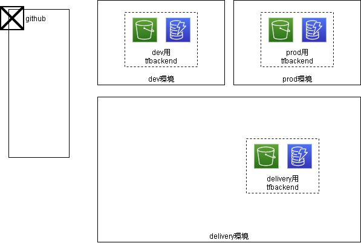
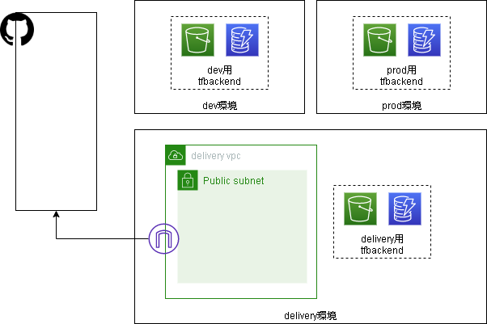
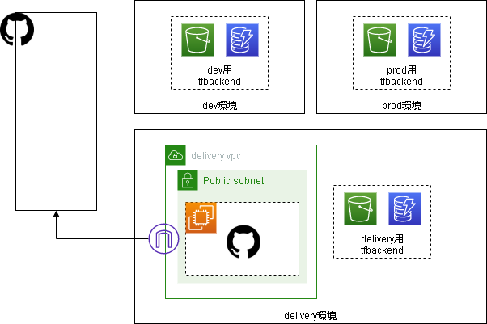
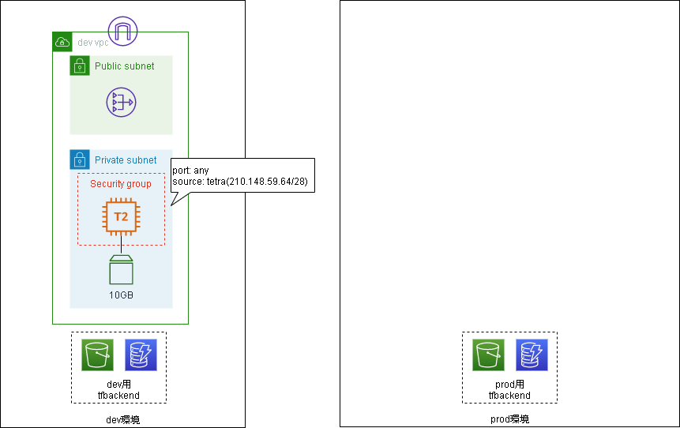
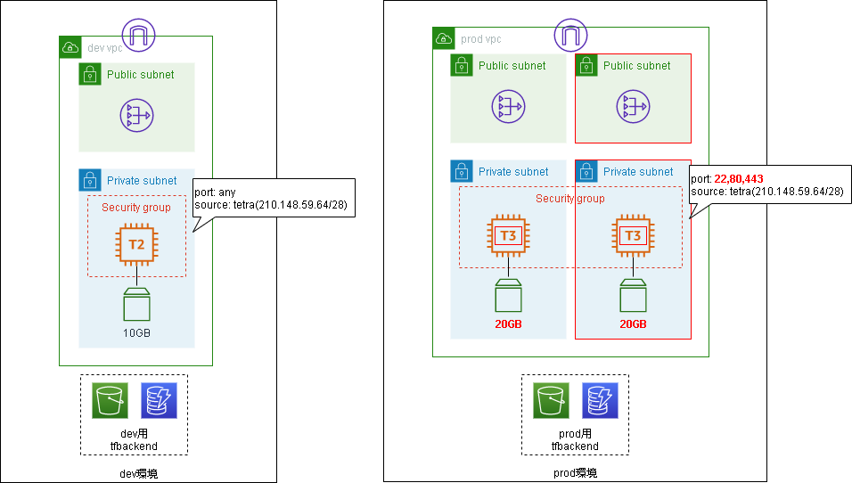

# 使い方

以下の順番で実行します。delivery環境構築の`ネットワーク`は自身の環境に合わせて実行要否を判断してください。delivery環境構築では`Githubレポジトリの準備`のみTerraformモジュールの実行ではなく、Githubのレポジトリに対する作業になります。また開発環境/本番環境へのデプロイはすべてGithubのレポジトリに対する作業になり、Terraformモジュールの実行はありません。

- delivery環境構築
  - tfバックエンド
  - ネットワーク（任意）
  - Githubレポジトリの準備
  - Github Runner
- 開発環境へのデプロイ
  - Githubへのソース配置
  - プルリクエスト作成/更新
  - プルリクエストマージ
- 本番環境へのデプロイ
  - ソース確認
  - プルリクエスト作成
  - プルリクエストマージ

まずは本レポジトリを任意の場所でクローンしてください。なお、以降の手順では任意のディレクトリのパスを`$CLONEDIR`環境変数として進めます。

``` sh
export CLONEDIR=`pwd`
git clone https://github.com/cnc4e/terraform-cicd.git
```

## delivery環境構築

delivery環境構築はプロジェクトで一度だけ行います。環境の分け方によっては複数実施するかもしれません。`main-template`ディレクトリをコピーして`環境名`ディレクトリなどの作成がオススメです。以下の手順では`tf-cicd`という環境名を想定して記載します。

``` sh
cd $CLONEDIR/terraform-cicd/terraform/environment
export PJNAME=tf-cicd
cp -r main-template $PJNAME
```

また、すべてのモジュールで共通して設定する`PJ-NAME`、`REGION`、`OWNER`の値はsedで置換しておくと後の手順が楽です。regionは他の手順でも使用するので環境変数にしておきます。以下の手順では`us-east-2`を設定します。

**Linuxの場合**

``` sh
cd $CLONEDIR/terraform-cicd/terraform/environment/$PJNAME
export REGION=us-east-2
find ./ -type f -exec grep -l 'REGION' {} \; | xargs sed -i -e 's:REGION:'$REGION':g'
find ./ -type f -exec grep -l 'PJ-NAME' {} \; | xargs sed -i -e 's:PJ-NAME:'$PJNAME':g'
find ./ -type f -exec grep -l 'OWNER' {} \; | xargs sed -i -e 's:OWNER:nobody:g'
```

**macの場合**

``` sh
cd $CLONEDIR/terraform-cicd/terraform/environment/$PJNAME
export REGION=us-east-2
find ./ -type f -exec grep -l 'REGION' {} \; | xargs sed -i "" -e 's:REGION:'$REGION':g'
find ./ -type f -exec grep -l 'PJ-NAME' {} \; | xargs sed -i "" -e 's:PJ-NAME:'$PJNAME':g'
find ./ -type f -exec grep -l 'OWNER' {} \; | xargs sed -i "" -e 's:OWNER:nobody:g'
```

### tfバックエンド

Terraformのtfstateを保存するバックエンドを作成します。ここでは`delivery`、`dev`、`production`の3つのバックエンドが作成されます。  
`delivery`以外はレポジトリで使用するブランチ名になります。変更したい場合は`tf-backend.tf`の`env_names`の値を修正してください。  

tfバックエンドモジュールのディレクトリへ移動します。

``` sh
cd $CLONEDIR/terraform-cicd/terraform/environment/$PJNAME/tf-backend
```

以下コマンドでリソースを作成します。

``` sh
terraform init
terraform apply
> yes
```

なお、以降の手順で作成するリソースの情報は上記手順で作成したS3バケットに保存されます。しかし、このモジュールで作成したS3やDynamoDBの情報は実行したディレクトリのtfstateファイルに保存されます。このtfstateファイルは削除しないようにしましょう。

**作成後のイメージ**



### ネットワーク

すでにVPCやサブネットがある場合、ネットワークのモジュールは実行しなくても良いです。その場合はVPCとサブネットのIDを確認し以降のモジュール内の`data.terraform_remote_state.network~`で定義している部分をハードコードで書き換えてください。ネットワークモジュールでVPCやサブネットを作成する場合は以下の手順で作成します。

ネットワークモジュールのディレクトリへ移動します。

``` sh
cd $CLONEDIR/terraform-cicd/terraform/environment/$PJNAME/network
```

`network.tf`を編集します。`locals`配下のパラメータを修正します。VPCやサブネットのCIDRは自身の環境にあわせて任意のアドレス帯に修正してください。

修正したら以下コマンドでリソースを作成します。

``` sh
terraform init
terraform apply
> yes
```

**作成後のイメージ**




### Githubレポジトリの準備
Githubにログインし、レポジトリを作成します。なお、Githubへのサインアップは済んでいるものとします。  
- メニューバー右の[+マーク] - [New repository]をクリックし、新規レポジトリ作成画面に移動します。
- 新規レポジトリ作成画面では以下を入力し、[Create repository]をクリックしてください。
  - レポジトリ名
  - レポジトリのVisiblity Private

特にVisiblityは必ず`Private`を選択してください。このレポジトリにプッシュされた内容は自動でAWSにデプロイされてしまいます。またフォークされたレポジトリからプルリクエストを作成することで、アクセス可能な第三者がセルフホストランナーで任意のコードを実行することができてしまいます。[参考](https://docs.github.com/ja/actions/hosting-your-own-runners/about-self-hosted-runners#self-hosted-runner-security-with-public-repositories)  
悪意のある第三者による不正を防ぐためにも必ず`Private`にしましょう。

レポジトリ名を環境変数として登録しておきます。  

``` sh
export REPOSITORYNAME=<レポジトリ名>
```

TerraformのバックエンドとしてS3を使用するため、GithubのSecretsにAWSの認証情報を登録します。認証情報をコード内にハードコードしてしまうと、万が一Githubにプッシュしてしまった場合に情報漏洩に繋がるリスクがあるため、Secretsを利用してください。
- レポジトリトップ画面から[Settings] - [Secrets] - [New repository secret]を順にクリックします。
- 以下の2つのsecretを作成します。

|Name|Value|
|-|-|
|AWS_ACCESS_KEY_ID|バックエンドを作成したユーザのAWSアクセスキー|
|AWS_SECRET_ACCESS_KEY|バックエンドを作成したユーザのAWSシークレットキー|

セルフホストランナーに与えるトークンを確認します。
- レポジトリトップ画面から[Settings] - [Actions] - [Self-hosted runner] - [Add runner]を順にクリックします。
- [Operatig System]を`Linux`に変更します。
- [Download]コードブロック内で以下のようなコマンドを探します。
  - `curl -O -L https://github.com/actions/runner/releases/download/v2.277.1/actions-runner-linux-x64-2.277.1.tar.gz`
  - `Github runnerのバージョン`の値（例示コマンドにおける`2.277.1`の部分）を控えてください。次の手順で使用します。
- [Configure]コードブロック内で以下のようなコマンドを探します。
  - `./config.cmd --url https://github.com/<ユーザ名>/<レポジトリ名> --token <レジストレーショントークン>`
  - `--url`の値と`--token`の値を控えてください。次の手順で使用します。


### Github Runner

Github Runnerサーバモジュールのディレクトリへ移動します。

``` sh
cd $CLONEDIR/terraform-cicd/terraform/environment/$PJNAME/github-runner
```

`github-runner.tf`を編集します。`region`と`locals`配下のパラメータを修正します。とくにec2_github_urlとec2_registration_tokenを`Githubレポジトリの準備`で確認した値に必ず修正してください。

**Linuxの場合**

``` sh
# ↓sedで置換する時、http:の`:`の前にエスケープを入れてください。例 https\://github.com
sed -i -e 's:GITHUB-URL:<先ほどGithubレポジトリで確認したURL>:g' github-runner.tf 
sed -i -e 's:REGIST-TOKEN:<先ほどGithubレポジトリで確認したレジストレーショントークン>:g' github-runner.tf
sed -i -e 's:RUNNER-VERSION:<先ほどGithubレポジトリで確認したGithub runnerのバージョン>:g' github-runner.tf
```

**macの場合**

``` sh
# ↓sedで置換する時、http:の`:`の前にエスケープを入れてください。例 https\://github.com
sed -i "" -e 's:GITHUB-URL:<先ほどGithubレポジトリで確認したURL>:g' github-runner.tf
sed -i "" -e 's:REGIST-TOKEN:<先ほどGithubレポジトリで確認したレジストレーショントークン>:g' github-runner.tf
sed -i "" -e 's:RUNNER-VERSION:<先ほどGithubレポジトリで確認したGithub runnerのバージョン>:g' github-runner.tf
```

修正したら以下コマンドでリソースを作成します。

``` sh
terraform init
terraform apply
> yes
```

上記実行が完了したらGithub側にRunnerが認識されているか確認します。

- Githubにログインし、レポジトリトップ画面から[Settings] - [Actions] - [Self-hosted runner]を確認し、作成したRunnerが表示されていれば登録完了です。表示されるまでには少し時間がかかります。

**作成後のイメージ**



## 開発環境へのデプロイ

`sample-repos`ディレクトリをコピーし、ソースをGithubの`dev`ブランチにプッシュします。その後、`feature`ブランチで修正を行いプルリクエストを作成&マージすることでCI/CDが行われます。

### Githubへのソース配置
ここからはterraformを実行する手順ではありません。Githubやターミナルで実施する手順になります。    
- `Githubレポジトリの準備`で作成したレポジトリをクローンし、`dev`ブランチに切り替え、そこにサンプルとなるTerraformコードをコピーします。

``` sh
cd $CLONEDIR
git clone <GithubレポジトリのクローンURL>
# クローン時にID/パスワードが求められたらGithubのユーザでログイン
cd $REPOSITORYNAME
git checkout -b dev
cp -r $CLONEDIR/terraform-cicd/sample-repos/. ./
```

- モジュールやCICDに使用するワークフローで設定する値を置換します。

**Linuxの場合**

``` sh
find ./ -type f -exec grep -l 'REGION' {} \; | xargs sed -i -e 's:REGION:'$REGION':g'
find ./ -type f -exec grep -l 'PJ-NAME' {} \; | xargs sed -i -e 's:PJ-NAME:'$PJNAME':g'
find ./ -type f -exec grep -l 'OWNER' {} \; | xargs sed -i -e 's:OWNER:nobody:g'
```

**macの場合**

``` sh
find ./ -type f -exec grep -l 'REGION' {} \; | xargs sed -i "" -e 's:REGION:'$REGION':g'
find ./ -type f -exec grep -l 'PJ-NAME' {} \; | xargs sed -i "" -e 's:PJ-NAME:'$PJNAME':g'
find ./ -type f -exec grep -l 'OWNER' {} \; | xargs sed -i "" -e 's:OWNER:nobody:g'
```

- Githubに`dev`ブランチをプッシュします。
```
git add .
git commit -m "init"
git push --set-upstream origin dev:dev
```

レポジトリルートに`.github/workflows/terraform-ci-dev.yml`が配置されていることで、プルリクエストの作成/更新をトリガにGithubActionsが動作します。  
また`.github/workflows/terraform-cd-dev.yml`が配置されていることで、プルリクエストのマージをトリガにGithubActionsが動作します。  

|ファイル|トリガ|GithubActionsで実行される処理|
|-|-|-|
|terraform-ci-dev.yml|プルリクエスト作成/更新|開発環境へterraform plan実行/ポリシーチェック|
|terraform-cd-dev.yml|プルリクエストマージ|開発環境へterraform apply実行|
|terraform-ci-production.yml|プルリクエスト作成/更新|本番環境へterraform plan実行/ポリシーチェック|
|terraform-cd-production.yml|プルリクエストマージ|本番環境へterraform apply実行|

また、本番環境のための`production`ブランチを作成しておきます。  
- Githubにログインし、レポジトリトップ画面から[ブランチマーク dev]をクリックします。
- [Find or create a branch...]に`production`と入力して、[Create branch: production from dev]をクリックします。

### プルリクエスト作成/更新
Githubでプルリクエストを作成し、GithubActionsを動作させてみます。プルリクエスト作成/更新時は以下が実行されます。
- **`terraform fmt`**
- **`terraform plan`**
- **`terraform plan`の結果をプルリクエストのコメントへ転記**
- **ポリシーチェックを実施**
- **ポリシーチェックの結果をプルリクエストのコメントへ転記**

なお、ポリシーチェックで使用するコードは`policy/`配下にあります。

マージ元となる`feature`ブランチを作成し、デプロイ内容の変更を行います。なお、最初はポリシーチェックに失敗するように変更します。
``` sh
cd $CLONEDIR/$REPOSITORYNAME
git checkout -b feature
sed -i -e 's:t2.micro:t2.large:g' main-template/dev/main.tf 
git add .
git commit -m "change instance type"
git push --set-upstream origin feature:feature 
```

Githubでマージ先：`dev`、マージ元：`feature`としてプルリクエストを作成します。
- Githubにログインし、レポジトリトップ画面から[Pull request] - [New pull request]を順にクリックします。
- `base: dev`、`compare: feature`を指定し、[Create pull request]をクリックします。

GithubActionsが動作し、`terraform plan`は成功するもののポリシーチェックに失敗しているのを確認します。
- Githubにログインし、レポジトリトップ画面から[Actions]をクリックします。
- 先ほど作成したプルリクエスト名でActionsが動作し、ポリシーチェックに失敗しています。動作していない場合はしばらく待ってみてください。
- レポジトリトップ画面から[Pull request]をクリックし、先ほど作成したプルリクエストを表示します。`terraform plan`の結果とポリシーチェックの結果がコメントされています。

`feature`ブランチでデプロイ内容の変更を行います。今度はポリシーチェックに成功するように変更します。
``` sh
cd $CLONEDIR/$REPOSITORYNAME
sed -i -e 's:t2.large:t2.micro:g' main-template/dev/main.tf 
git add .
git commit -m "change instance type"
git push
```

GithubActionsが動作し、`terraform plan`とポリシーチェックに成功しているのを確認します。
- Githubにログインし、レポジトリトップ画面から[Actions]をクリックします。
- 先ほど作成したプルリクエスト名でActionsが動作し、`terraform plan`とポリシーチェックに成功しています。動作していない場合はしばらく待ってみてください。
- レポジトリトップ画面から[Pull request]をクリックし、先ほど作成したプルリクエストを表示します。`terraform plan`の結果とポリシーチェックの結果がコメントされています。

### プルリクエストマージ
  
プルリクエストをマージし、GithubActionsを動作させてみます。プルリクエストマージ時は以下が実行されます。
- **`terraform apply`**
- **`terraform apply`の結果をプルリクエストのコメントへ転記**

プルリクエストにコメントされた`terraform plan`とポリシーチェックの内容で相違なければ、`feature`ブランチをマージします。
- レポジトリトップ画面から[Pull request]をクリックし、先ほど作成したプルリクエストを表示します。下部の[Merge pull request]をクリックします。

GithubActionsが動作し、`terraform apply`に成功しているのを確認します。
- Githubにログインし、レポジトリトップ画面から[Actions]をクリックします。
- 先ほど作成したプルリクエスト名でActionsが動作し、`terraform apply`に成功しています。動作していない場合はしばらく待ってみてください。
- レポジトリトップ画面から[Pull request]をクリックし、先ほど作成したプルリクエストを表示します。`terraform apply`の結果がコメントされています。

ここまでの手順で、CICDパイプラインを通して`dev`ブランチから開発環境にサービスをデプロイすることができました。  
  

## 本番環境へのデプロイ

本番環境へのデプロイを行います。本番環境では冗長構成にし、ポリシーもより厳しいものを使用します。  
`dev`ブランチで修正を行い、`production`ブランチに対してプルリクエストを作成&マージして本番環境へのデプロイを行います。  

```sh
cd $CLONEDIR/$REPOSITORYNAME
git checkout dev
git pull
```

### ソース確認
**main-template/production/main.tf**  
デプロイ対象が冗長構成であることを確認します。VPCやサブネットの値は個別環境に合わせて読み替えてください。サブネットは2つずつ指定されていれば構いません。  

```
# parameter settings
locals {
  pj       = "PJ-NAME"
  vpc_cidr = "10.3.0.0/16"
  vpc_id   = module.deployed_network.vpc_id
  tags = {
    pj    = "PJ-NAME"
    owner = "OWNER"
  }

  subnet_public_cidrs  = ["10.3.10.0/24", "10.3.11.0/24"]
  subnet_private_cidrs = ["10.3.20.0/24", "10.3.21.0/24"]

  ec2_subnet_id              = module.deployed_network.private_subnet_ids[0]
  ec2_instance_type          = "t2.large"
  ec2_root_block_volume_size = 30
  ec2_key_name               = ""

  sg_ingress_port = [22, 80, 443]
  sg_ingress_cidr = "210.148.59.64/28"
}
```

**main-template/production/versions.tf**  
バックエンドが本番環境のものであることを確認します。`PJ-NAME`、`REGION`の値は個別環境に合わせて読み替えてください。開発環境では`dev`と指定している値が`production`に変更されています。  

```
backend "s3" {
    bucket         = "PJ-NAME-tfstate-production"
    key            = "deploy/terraform.tfstate"
    encrypt        = true
    dynamodb_table = "PJ-NAME-tfstate-lock-production"
    region         = "REGION"
  }
```

**policy/production/deploy.rego**  
冗長構成に合わせたポリシーであることを確認します。  

```
# Parameters
ec2_instance_type = "t2.large"
ec2_root_block_volume_size = 20
sg_ingress_port = [22, 80, 443]
sg_ingress_cidr = "210.148.59.64/28"
subnet_count = 2
natgw_count = 2
```

### プルリクエスト作成
開発環境と同じようにGithubでプルリクエストを作成し、GithubActionsを動作させてみます。  

Githubでマージ先：`production`、マージ元：`dev`としてプルリクエストを作成します。
- Githubにログインし、レポジトリトップ画面から[Pull request] - [New pull request]を順にクリックします。
- `base: production`、`compare: dev`を指定し、[Create pull request]をクリックします。

GithubActionsが動作し、`terraform plan`とポリシーチェックに成功しているのを確認します。
- Githubにログインし、レポジトリトップ画面から[Actions]をクリックします。
- 先ほど作成したプルリクエスト名でActionsが動作し、`terraform plan`とポリシーチェックに成功しています。動作していない場合はしばらく待ってみてください。
- レポジトリトップ画面から[Pull request]をクリックし、先ほど作成したプルリクエストを表示します。`terraform plan`の結果とポリシーチェックの結果がコメントされています。

### プルリクエストマージ
  
開発環境と同じようにプルリクエストをマージし、GithubActionsを動作させてみます。

プルリクエストにコメントされた`terraform plan`とポリシーチェックの内容で相違なければ、`dev`ブランチをマージします。
- レポジトリトップ画面から[Pull request]をクリックし、先ほど作成したプルリクエストを表示します。下部の[Merge pull request]をクリックします。

GithubActionsが動作し、`terraform apply`に成功しているのを確認します。
- Githubにログインし、レポジトリトップ画面から[Actions]をクリックします。
- 先ほど作成したプルリクエスト名でActionsが動作し、`terraform apply`に成功しています。動作していない場合はしばらく待ってみてください。
- レポジトリトップ画面から[Pull request]をクリックし、先ほど作成したプルリクエストを表示します。`terraform apply`の結果がコメントされています。

これで本番環境へのデプロイが完了しました。  
  

## 環境削除

構築したときの逆の以下モジュール順に`terraform destroy`を実行してください。

### デプロイの削除
**本番環境**  

``` sh
cd $CLONEDIR/$REPOSITORYNAME/main-template/production
terraform init
terraform destroy
> yes
```

**開発環境**  

``` sh
cd $CLONEDIR/$REPOSITORYNAME/main-template/dev
terraform init
terraform destroy
> yes
```

### Github runnerの削除

``` sh
cd $CLONEDIR/terraform-cicd/terraform/environment/$PJNAME/github-runner
terraform destroy
> yes
```

### ネットワークの削除

``` sh
cd $CLONEDIR/terraform-cicd/terraform/environment/$PJNAME/network
terraform destroy
> yes
```

### tfバックエンドの削除

バックエンドはバケットにデータが残っていると削除できません。マネージメントコンソールなどでS3バケット内のでデータを先に削除してください。また、バージョニングを有効にしているため、すべてのバージョンを表示してから削除するようにしてください。すべてのデータを消したら以下コマンドでリソースを削除します。

``` sh
cd $CLONEDIR/terraform-cicd/terraform/environment/$PJNAME/tf-backend
terraform destroy
> yes
```

### ディレクトリ等の掃除

以下ディレクトリも削除します。

``` sh
rm -rf $CLONEDIR/terraform/environment/$PJNAME
rm -rf $CLONEDIR/$REPOSITORYNAME
```