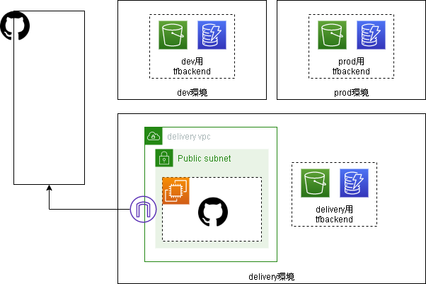

# モジュールの説明
`環境構築モジュール群`と`デプロイモジュール群`に分かれます。`環境構築モジュール群`は作業中にそれぞれ1回だけ実行し、CICD環境を整えるためのモジュールです。`デプロイモジュール群`は開発環境と本番環境のそれぞれでCICDの対象としてポリシーチェックを受けたりGithubActionsからデプロイされたりするモジュールです。  
どちらも`main`と`module`のディレクトリに分かれていて、基本的に利用者は`main`配下のtfファイル内にあるlocalsの値のみ修正し実行します。`module`は各モジュールが実行するサブモジュール群です。基本的に利用者はmodule配下を気にする必要はありません。（追加の設定など細かなカスタマイズが必要な方や実装が気になる方は見てください。）  
また、各モジュールを実行した後に作成されるtfstateはリモートのバックエンドへ保存します。バックエンドはS3バケットとDynamoDBで構成されます。tfstateはS3バケットに保存されます。tfstateへの書き込みはDynamoDBで排他制御を行います。バックエンドにtfstateを保存することで複数人での環境の共有やモジュール間のパラメータ連携が可能になります。  

## 環境構築モジュールの説明

以下環境をセットアップするterraformモジュールを用意しています。

- tfバックエンド
- ネットワーク
- Github Runner

全体はこのような構成になります。  
  

### tfバックエンド

`tfバックエンド`は各モジュール実行後に作成されるtfstateファイルを保存するS3バケットとDynamoDBを構築するterraformモジュールです。`delivery`、`dev`、`production`の3つの環境を作成します。環境構築モジュールではこの内`delivery`バックエンドを使用します。これにより、モジュール間でパラメータ（VPC IDなど）を連携させています。なお、このモジュール自体のtfstateファイルはリモートに保存されず、モジュールを実行した端末のローカルディスク（実行時のカレントディレクトリ）に保存されます。そのため、このモジュールのtfstateファイルについては慎重に管理してください。

### ネットワーク

`ネットワーク`はVPCとパブリックサブネットを構築するterraformモジュールです。インターネットゲートウェイも構築します。このモジュールで作成した`VPCのID`や`サブネットのID`は他のモジュールでも使用します。このモジュールはVPCがない場合などに実行ください。すでにVPCやサブネットがある場合はそれらのIDを他モジュールで使用してください。

### Github Runner

`Github Runner`はGithub Actionsによるパイプライン処理を実行するGithub Runnerサーバを構築するモジュールです。AMIは最新のAmazon Linuxを使用します。接続するGithubレポジトリと認証用のトークンを設定し、Runnerのセットアップを行います。このセットアップはUserdataにより自動で行います。また、以下の追加機能を任意で設定できます。追加機能はデフォルトでは`無効`にしています。

|機能|説明|
|-|-|
|自動起動/停止スケジュール|Github サーバは自動で起動/停止するスケジュールを設定します。有効にした場合、デフォルトでは平日の日本時間09-19時の間に起動するように設定します。スケジュールは任意の値に変更可能です。|

## デプロイモジュールの説明

以下環境をセットアップするterraformモジュールを用意しています。モジュールは開発環境と本番環境で共通です。

- ネットワーク
- インスタンス

開発環境と本番環境を含めた全体はこのような構成になります。  

### ネットワーク

`ネットワーク`はVPCとパブリックサブネットおよびプライベートサブネットを構築するterraformモジュールです。インターネットゲートウェイやNATゲートウェイも構築します。`EC2インスタンス`のデプロイ先となります。`main`でパラメータを指定することにより、各サブネットやNATゲートウェイを環境に合わせて冗長化することができます。

### インスタンス

`インスタンス`はEC2インスタンスとセキュリティグループを構築するterraformモジュールです。`ネットワーク`モジュールで構築したVPC、サブネットにデプロイします。`main`でパラメータを指定することにより、インスタンスタイプやEBSボリュームサイズ、インバウンドポートなどを調整することができます。
